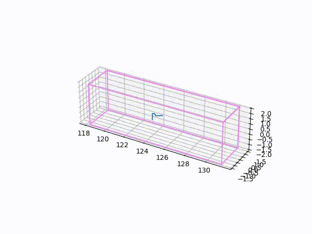
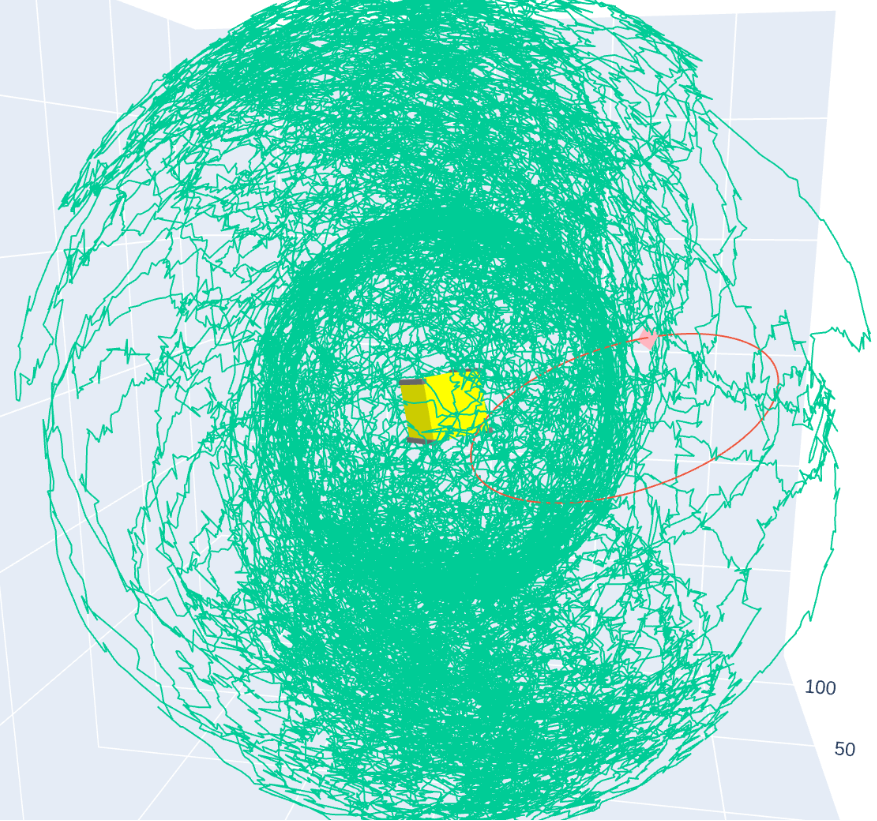
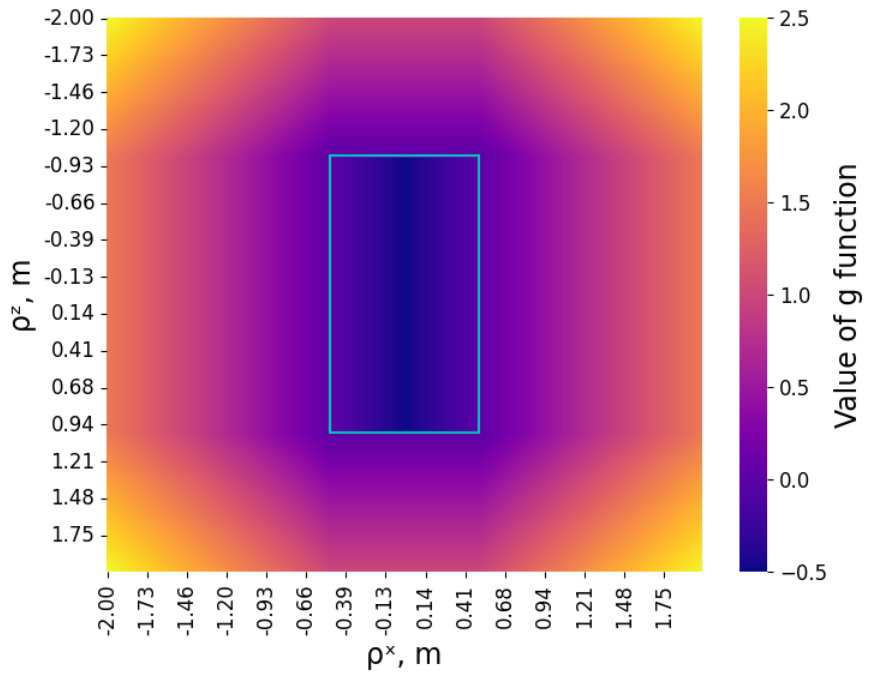

## Репозиторий с отдельными Python- и Jupyter-файлами и микропроектами
----------

Каталоги:
- DissertationMaster: вспомогательные Jupyter-файлы для задачи **орбитальной сборки**
- DissertationPhd: вспомогательные Jupyter-файлы для задачи **полёта роя** (+ код коллеги)
- FlyInTheBus: **муха** в автобусе иногда бьётся об окно, а иногда не бьётся (решение философвского вопроса)
- LogisticGraph1: для каждого **узла** заданного **графа** рассчитывается **путь** наискорейшего прохождения в любую точку
- LogisticGraph2: генерит docx-файлики для заданного **графа**, там примеры инпута в стороже, результат в корне
- MyCarEngine: непризнанный гений страдает хернёй
- NearEarthCoordinates: перевод между системами координат с дальнейшим преобразованием как **локальную библиотеку** через **wheel**
- Study: ну вроде тут должны быть записи по курсам

Файлы:
- Graphic solution: графическое решение системы уравнений
- Differential evolution: один из неградиентных методов поиска минимума функционала в области значений
- Translater: перевод абзацев из буфера обмена
- Symbolic LQR: реализация линейно-квадратичного регулятора
- Chapter 2 NIR: вторая глава диплома, поиск начальных приближений для аналитически нерешаемой задачи

## Бесполезная галерея
- Прыжки в длинну и ширину:

- Огибание препятствий:

- Муха в автобусе:

- Машинки катаются в своё удовольствие:

- Диско-шар:

- Ментальная аура банки пепси:

